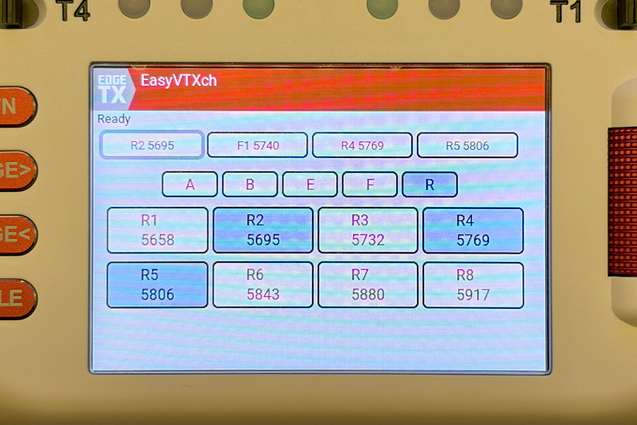

# EasyVTXch

> **[English version](README.md)**

**EdgeTX + ELRS 用 ワンタップ VTX チャンネル切り替えスクリプト**

ELRS で VTX チャンネルを変更するには通常 8〜10 回のボタン操作が必要です：
SYS → Tools → ELRS → 待ち → VTX Admin → Band → Channel → Power → Send

**EasyVTXch なら 2 ステップで完了：** スクリプトを起動 → チャンネルをタップ。以上。



## 機能

- **ワンタップ切り替え** — チャンネルボタンをタップするだけで VTX コマンドが即座に送信されます
- **お気に入り** — チャンネルを長押しで登録。画面上部にクイックアクセスグリッドとして表示されます
- **全 5 バンド対応** — A, B, E, F, R × 各 8 チャンネル（合計 40 チャンネル）
- **周波数表示** — 各ボタンに実際の周波数（MHz）を表示
- **設定の自動保存** — お気に入りと最後に選択したバンドは電源を切っても保持されます
- **全プロポ対応** — カラー LCD プロポ（TX16S, TX15 等）で動作。モノクロ LCD（Boxer, Zorro, TX12 等）は実装済みですが未テストです

> **注意:** EasyVTXch はバンドとチャンネルのみを変更します。VTX の出力パワーは変更されません。現在のパワー設定がそのまま維持されます。

## 必要なもの

| 項目 | 詳細 |
|------|------|
| **プロポファームウェア** | EdgeTX 2.11 以降 |
| **TX モジュール** | ELRS モジュール（内蔵・外付け問わず） |
| **VTX** | SmartAudio, Tramp, または HDZero（DisplayPort）対応の VTX |
| **レシーバー** | VTX と接続された ELRS レシーバー |

> **自分の環境で使えるか確認するには？** ゴーグルの OSD から VTX のチャンネルやパワーを変更できるなら（Betaflight OSD → VTX 設定）、SmartAudio/Tramp はすでに動いています。EasyVTXch は同じ接続を使います — OSD の代わりにプロポから操作するだけです。

## インストール

**ファイル 1 つだけ。依存なし、設定不要。**

1. [Releases ページ](https://github.com/Saqoosha/EasyVTXch/releases)から [`EasyVTXch.lua`](https://github.com/Saqoosha/EasyVTXch/releases/latest/download/EasyVTXch.lua) をダウンロード
2. プロポの SD カードにコピー：
   ```
   /SCRIPTS/TOOLS/EasyVTXch.lua
   ```
3. 以上！プロポの **SYS → Tools → EasyVTXch** から起動できます

### SD カードへのコピー方法

- **USB 接続:** プロポを USB で接続し「USB Storage」モードを選択してファイルをコピー
- **SD カードリーダー:** SD カードを取り出してカードリーダーでコピー

### アップデート方法

新しいバージョンの `.lua` ファイルで上書きするだけです。更新が反映されない場合は、同じフォルダにある `EasyVTXch.luac` を削除してください（EdgeTX がコンパイル済みスクリプトをキャッシュしているため）。

## 使い方

### 手順

1. **プロポの電源を入れる** — EdgeTX の起動を待つ
2. **ドローンにバッテリーを接続**（または VTX の電源を入れる）
3. **バインドを確認** — TX モジュールとレシーバーが接続されていることを確認
4. **SYS → Tools → EasyVTXch** — スクリプトを起動
5. **チャンネルをタップ** — 完了！

### カラー LCD プロポ（TX16S, TX15 等）

| 操作 | 動作 |
|------|------|
| **チャンネルボタンをタップ** | VTX コマンドが即座に送信されます |
| **チャンネルボタンを長押し** | お気に入りに追加／解除 |
| **バンドボタンをタップ**（A/B/E/F/R） | そのバンドのチャンネル一覧に切り替え |

お気に入りチャンネルは画面上部にクイックアクセスグリッドとして表示されます。

### モノクロ LCD プロポ（Boxer, Zorro, TX12 等）

> **注意:** モノクロ LCD 対応は実装済みですが、実機でのテストはまだ行っていません。

| 操作 | 動作 |
|------|------|
| **スクロール**（エンコーダー/ボタン） | チャンネルリストを移動 |
| **Enter** | VTX コマンドを送信 |
| **Enter 長押し** | お気に入りに追加／解除 |
| **Menu** | バンド切り替え（A → B → E → F → R） |

お気に入りは `*` マーク付きでリスト上部に表示されます。

## トラブルシューティング

| 症状 | 対処法 |
|------|--------|
| "TX module not found" | ELRS モジュールの電源が入っていてバインド済みか確認。EdgeTX のプロトコル設定で CRSF が選択されているか確認。 |
| "VTX Admin not found" | ELRS 側で VTX Admin が有効になっている必要があります。ExpressLRS Configurator か ELRS Lua スクリプトで確認してください。 |
| "VTX fields incomplete" | ELRS ファームウェアが古い可能性があります。ELRS 3.x 以降にアップデートしてください。 |
| Tools にスクリプトが表示されない | ファイル名が `EasyVTXch.lua`（大文字小文字を区別）であること、`/SCRIPTS/TOOLS/` に配置されていることを確認。 |
| ファイルを置き換えても更新されない | 同じフォルダの `EasyVTXch.luac` を削除してください。EdgeTX がキャッシュを使っています。 |
| チャンネルは変わるが VTX が反応しない | レシーバーと VTX 間の配線（SmartAudio, Tramp, または DisplayPort）を確認。VTX がそのプロトコルに対応しているかも確認してください。 |

## 対応周波数一覧

| バンド | Ch1  | Ch2  | Ch3  | Ch4  | Ch5  | Ch6  | Ch7  | Ch8  |
|--------|------|------|------|------|------|------|------|------|
| A      | 5865 | 5845 | 5825 | 5805 | 5785 | 5765 | 5745 | 5725 |
| B      | 5733 | 5752 | 5771 | 5790 | 5809 | 5828 | 5847 | 5866 |
| E      | 5705 | 5685 | 5665 | 5645 | 5885 | 5905 | 5925 | 5945 |
| F      | 5740 | 5760 | 5780 | 5800 | 5820 | 5840 | 5860 | 5880 |
| R      | 5658 | 5695 | 5732 | 5769 | 5806 | 5843 | 5880 | 5917 |

FPV の主要 VTX メーカーで共通の標準周波数バンドです。

## 開発者向け

内部アーキテクチャ、CRSF プロトコルの詳細、実装メモについては [ARCHITECTURE.md](ARCHITECTURE.md) を参照してください。

### テストの実行

```bash
lua5.4 test_mock.lua
```

## ライセンス

MIT
